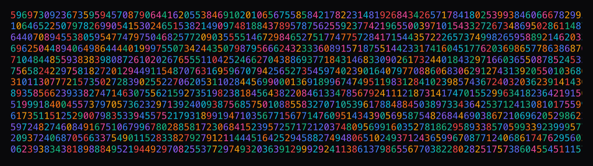

# @creativoma/numeric-background


A modern React component that generates animated numeric backgrounds with different color and opacity variants. Perfect for adding a dynamic visual touch to your applications.

[](https://www.npmjs.com/package/@creativoma/numeric-background)

## 🚀 Installation

```bash
npm install @creativoma/numeric-background
```

```bash
yarn add @creativoma/numeric-background
```

```bash
pnpm add @creativoma/numeric-background
```

## 📖 Basic Usage

```jsx
import { NumericBackground } from '@creativoma/numeric-background'

function App() {
  return (
    <NumericBackground variant="multicolor">
      <div className="p-8">
        <h1>Your content here</h1>
        <p>The numeric background is rendered behind this content</p>
      </div>
    </NumericBackground>
  )
}
```

## 🎨 Available Variants

### Multicolor

Numbers in vibrant random colors:


```jsx
<NumericBackground variant="multicolor">{/* Your content */}</NumericBackground>
```

### Single Color

All numbers in the same color:

```jsx
<NumericBackground variant="single" color="#ff6b6b">
  {/* Your content */}
</NumericBackground>
```

### With Opacity

Numbers with adjustable transparency:


```jsx
<NumericBackground variant="opacity" color="#8b5cf6" opacity={0.15}>
  {/* Your content */}
</NumericBackground>
```

### Matrix

Matrix-style effect with static numbers:


```jsx
<NumericBackground variant="matrix" color="#00ff00">
  {/* Your content */}
</NumericBackground>
```

## ⚙️ Props

| Prop        | Type                                                | Default             | Description                                         |
| ----------- | --------------------------------------------------- | ------------------- | --------------------------------------------------- |
| `variant`   | `'multicolor' \| 'single' \| 'opacity' \| 'matrix'` | `'multicolor'`      | Background variant                                  |
| `color`     | `string`                                            | `'#3b82f6'`         | Color for 'single', 'opacity' and 'matrix' variants |
| `opacity`   | `number`                                            | `0.1`               | Opacity for 'opacity' variant                       |
| `fontSize`  | `number`                                            | `16`                | Font size of the numbers                            |
| `numbers`   | `string[]`                                          | `['0','1',...,'9']` | Array of numbers to display                         |
| `className` | `string`                                            | `''`                | Additional CSS classes                              |
| `children`  | `React.ReactNode`                                   | -                   | Content to display over the background              |
| `width`     | `number`                                            | `auto`              | Custom canvas width                                 |
| `height`    | `number`                                            | `auto`              | Custom canvas height                                |

## 💡 Advanced Examples

### Custom Numbers


```jsx
<NumericBackground
  variant="multicolor"
  numbers={['α', 'β', 'γ', 'δ', 'ε', 'π', 'Σ', '∞']}
  fontSize={20}
>
  <div className="p-8">
    <h2>Mathematical symbols</h2>
  </div>
</NumericBackground>
```

### Full Page Background

```jsx
<NumericBackground variant="opacity" className="min-h-screen" opacity={0.05}>
  <div className="relative z-10 container mx-auto py-12">
    <h1 className="mb-8 text-4xl font-bold">My Application</h1>
    <p>Main content with subtle numeric background</p>
  </div>
</NumericBackground>
```

### High Density Configuration

```jsx
<NumericBackground
  variant="matrix"
  color="#10b981"
  fontSize={12}
  numbers={['1', '0']}
  width={800}
  height={600}
>
  <div className="p-12">
    <h2>Custom Matrix Effect</h2>
  </div>
</NumericBackground>
```

### Canvas with Fixed Dimensions

```jsx
<NumericBackground
  variant="single"
  color="#ff6b6b"
  width={1200}
  height={800}
  fontSize={18}
>
  <div className="flex h-full items-center justify-center">
    <h1>Background with fixed dimensions</h1>
  </div>
</NumericBackground>
```

## 🛠️ Development

```bash
# Clone the repository
git clone https://github.com/creativoma/numeric-background.git
cd numeric-background

# Install dependencies
npm install

# Development mode
npm run dev

# Linting and formatting
npm run lint
npm run format

# Build library
npm run build

# Build demo
npm run build:demo

# Preview
npm run preview

# Publish (requires permissions)
npm publish
```

## 🧪 Project Structure

```
numeric-background/
├── src/
│   ├── components/
│   │   ├── constants.ts
│   │   ├── NumericBackground.tsx
│   │   └── types.ts
│   ├── App.tsx                 # Demo application
│   ├── main.tsx               # Demo entry point
│   ├── index.ts               # Library entry point
│   └── index.css
├── dist/                      # Compiled files
├── public/                    # Demo assets
├── README.md
├── package.json
├── tsconfig.json
├── vite.config.ts            # Demo build config
├── vite.config.lib.ts        # Library build config
└── tailwind.config.js
```

## 📋 Requirements

- React >= 18.0.0
- React DOM >= 18.0.0

## 🏗️ Technologies

- **React** - Component library
- **TypeScript** - Static typing
- **Vite** - Build tool and bundler
- **Tailwind CSS** - CSS framework

## 📦 Available Formats

This package includes multiple formats for maximum compatibility:

- **ESM** (`dist/index.esm.js`) - For modern applications
- **UMD** (`dist/index.umd.js`) - For universal compatibility
- **TypeScript** (`dist/index.d.ts`) - Type definitions

## 🤝 Contributing

Contributions are welcome! Please:

1. Fork the project
2. Create a branch for your feature (`git checkout -b feature/amazing-feature`)
3. Commit your changes (`git commit -m 'Add amazing feature'`)
4. Push to the branch (`git push origin feature/amazing-feature`)
5. Open a Pull Request

## 📄 License

MIT © [creativoma](https://github.com/creativoma)

## 🏷️ Changelog

See [CHANGELOG.md](CHANGELOG.md) for a detailed list of changes.
